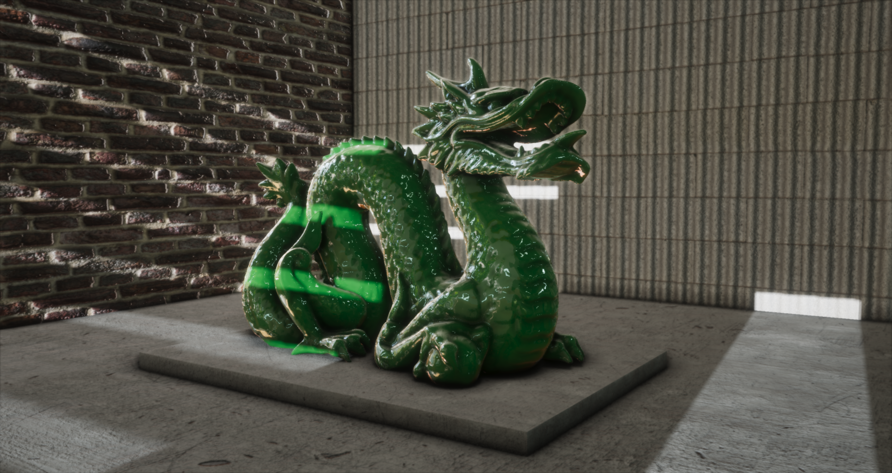
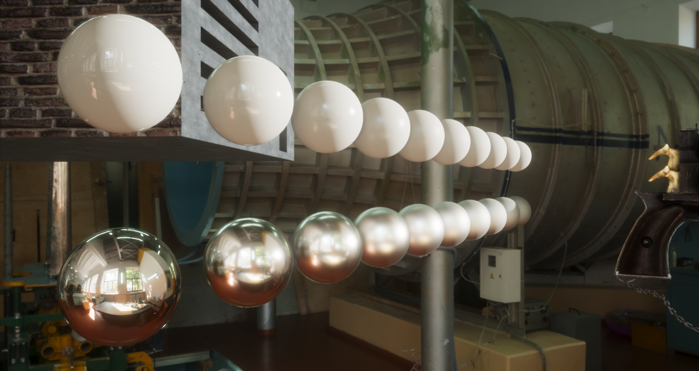
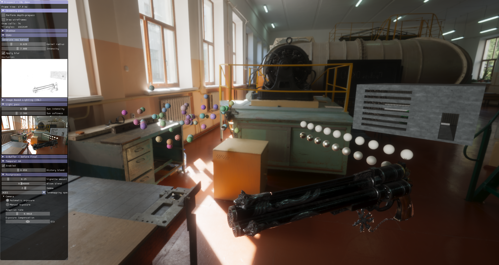
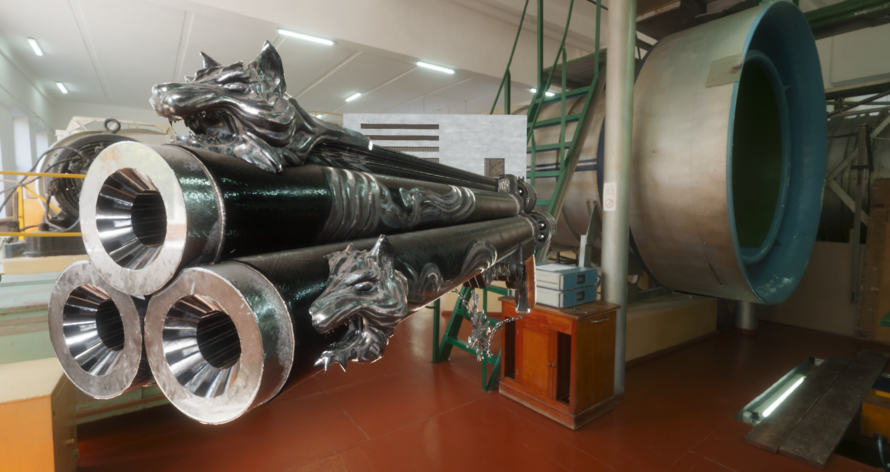
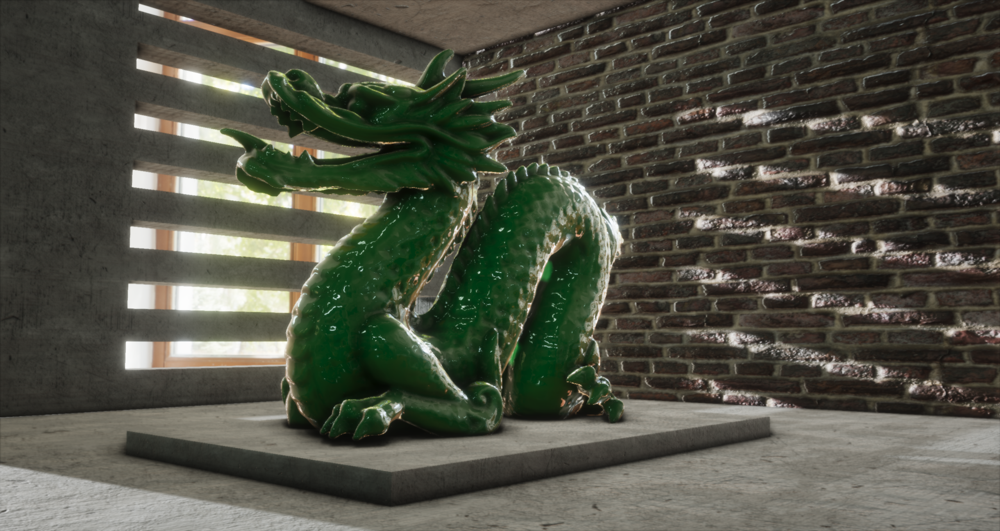
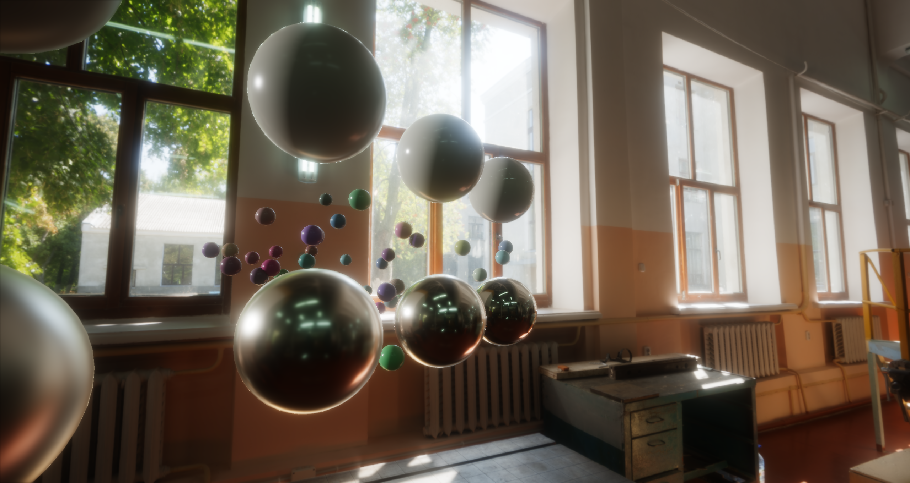
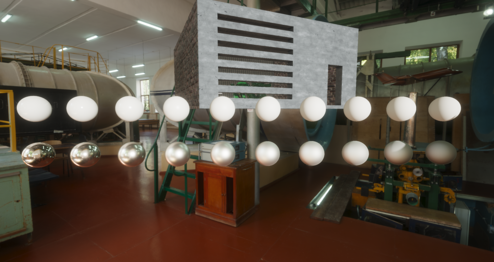
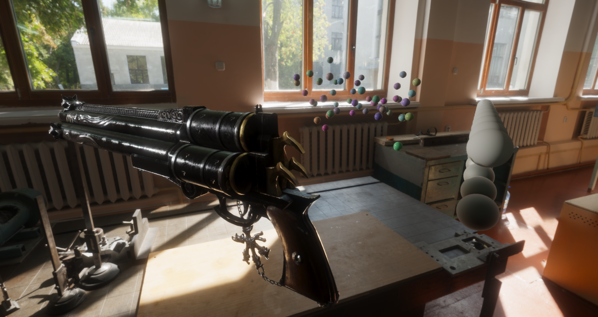

# _**Prospect**_ – A Real-Time Renderer
by *Simon Moos*, Twitter [@SimonMoos](https://twitter.com/SimonMoos), GitHub [Shimmen](https://github.com/Shimmen/)


This is my personal real-time render that I've been working on periodically over the course of many years. The goal has always been to create a renderer that is flexible and extensible, so that it can act as my playground for experimenting with new techniques and implementing papers etc.

Over time I've implemented a lot of different techniques, and while it's not pushing any technical boundaries it can produce a nice looking image that is somewhat state-of-the-art (pre real-time ray tracing). For ray tracing stuff, see my Vulkan renderer I made as part of my Master's thesis, [Arkose Renderer](https://github.com/Shimmen/ArkoseRenderer/).

</img>
</img>
</img>
</img>


## Features

The renderer is a deferred render in its core. It's written in modern OpenGL (version 4.6) and tries to use bindless resources where possible. It has support for (in no particular order):

 - Bloom
 - Normal mapping
 - GGX microfacet materials
 - HDR rendering with ACES tonemapping
 - Directional light (spot- & point- lights will be added)
 - PCF shadows (with noise & temporal blur)
 - A physically plausible camera model with both automatic & manual exposure controls
 - Image Based Lighting (IBL) for indirect light, including the filtering to generate radiance & irradiance probes
 - Dynamically filtered light probes (i.e., we can generate irradiance & radiance maps)
 - Irradiance light probes encoded using Spherical Harmonics
 - Screen-space Ambient Occlusion (SSAO) using the hemisphere method
 - Temporal Anti-Aliasing (TAA), for AA purposes but also for smoothing out noisy SSAO & shadows

Some features that aren't yet implemented but are soon to come are:
 - Screen-space reflections
 - Interactive probe updating, including rendering cubemaps, remapping, and filtering to get radiance & irradiance
 - Depth of field (probably [this technique](http://tuxedolabs.blogspot.com/2018/05/bokeh-depth-of-field-in-single-pass.html))
 - Motion blur (probably [this paper](https://casual-effects.com/research/Guertin2013MotionBlurReport/Guertin2013MotionBlur-small.pdf))
 - Support for multiple local light probes for diffuse GI (something like [this paper](https://research.nvidia.com/publication/real-time-global-illumination-using-precomputed-light-field-probes))
 - Volumetric scattering, for crepuscular rays & fog

Further down the road I would also like to add:
 - Deferred decals
 - Particle systems


### G-Buffer layout

The layout of the g-buffer is described in the figure below. Each row describes a texture with its components separated by a vertical bar:

```
Albedo & alpha      RGBA8:    |--R--|--G--|--B--|--A--|
Material properties RGBA8:    |--r--|--m--|-----|-----|
Normals & velocity  RGBA16F:  |-normal a--|-normal b--|-vel x-----|-vel y-----|
Non-linear depth    Depth32F: |-depth-----------------|
```

where `r` is material roughness, `m` is material metallic, normal `a` and `b` are the two components of an octahedral-encoded view-space normal, and vel `x` and `y` are the comonents of the screen space velocity.

Clearly materials texture is not very efficiently packed, but the idea was to leave room for potential future properties such as emissive and subsurface scattering.

### Engine features

Beyond the rendering & graphics features listed above, the engine also supports:

 - Asynchronous texture loading
 - Asynchronous .OBJ model loading
 - Hot reloading of shader programs, with error logs in the GUI
 - A custom Dear ImGui integration

---

</img>
</img>
</img>
</img>

## Design
As mentioned the renderer is designed to be flexible and extendable and for personal use. For this reason some design choices have been made that aren't necessarily obvious. In previous projects I've opted for the more traditional make-abstractions-for-each-api-type, e.g. a `Texture` class and a `Buffer` type. While this can work fine it takes a lot of work to maintain the abstraction when adding features. E.g. adding 3D texture support: how should it relate to the `Texture` class, and how should it interact with the `FrameBuffer` class for attaching, etc.

For this project I've instead gone for a more simplistic approach. The main way of referring to e.g textures on the CPU is through the `GLuint` texture handle. If you want or need to make some abstraction you are free to do so and wrap the handle in them, and it won't disrupt anything else. For loading and managing assets there are *systems* e.g. the `TextureSystem`, which can, given a file path to a texture, return a texture `GLuint` handle.

While there are some pain points with this approach, such as setting shader uniform, I think this is an overall good approach for this type of experimental/flexible rendering engine. For a more abstract API design, see [my more recent Vulkan renderer](https://github.com/Shimmen/ArkoseRenderer/), which uses a type of render-graph system.


## Repository structure

```bash
Prospect
|-- assets       # all run-time assets, except shaders (e.g. 3D models, images)
|-- src          # most .h and .cpp files used to build this renderer
|-- shaders      # all GLSL shader files (.h-files are also visible from C/C++)
|   |-- material # shaders writing to the g-buffer, i.e. materials
|   |-- light    # shaders used to accumulate light, often reading from the g-buffer
|   |-- ibl      # shaders involved in generating assets for Image Based Lighting (IBL)
|   |-- post     # shaders used for post-fx, e.g. filters & SSAO
|   |-- gui      # shaders for the Dear ImGui integration
|   `-- etc      # other shaders
|-- deps         # third-party code dependencies
`-- images       # images for this very readme file
```


## Third-party libraries
A small set of third-party libraries are used. They are all listed below and are included in the source tree of this project and are built and statically linked.

 - [GLFW](https://www.glfw.org/) for window & context management
 - [glad](https://github.com/Dav1dde/glad) for context & extension loading
 - [Dear ImGui](https://github.com/ocornut/imgui) for immediate mode GUI
 - [glm](https://glm.g-truc.net/0.9.9/index.html) for math functions and types
 - [stb_image](https://github.com/nothings/stb/blob/master/stb_image.h) for loading a bunch of different image formats
 - [tinyobjloader](https://github.com/syoyo/tinyobjloader) for loading OBJ+MTL 3D models+materials


## How to get it up and running
As this is my personal renderer I've only tested it on my machine, so I'm not sure that anything will work for anyone else. However, all third-party code is included in this source-tree and most assets are too (some high resolution ones are left out to keep the size down), so it should be possible to just clone it and make a project using CMake. It only works on Windows though, due to shader file watching, which I have never specialized for anything but Windows.


## License
This project is licenced under the [MIT License](https://choosealicense.com/licenses/mit/). See the file `LICENSE` for more information. Third-party dependencies (in `deps/`) and third-party assets (in `assets/`) are potentially licensed under other terms. See their respective directories & files for additional information.
